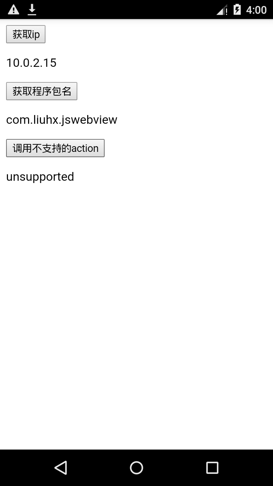

# JavaScript与WebView交互框架设计

## 总体设计
现在最新的xcode都只支持iOS8.0以上的版本了，所以iOS应该直接使用性能高、功能多的WKWebView接口。UIWebView的注入对象方式需要依赖KVC，且有坑，不建议使用。本文都以WKWebView的接口来设计。

数据从native传递到js只有一种方法:
- ios是`[webView evaluateJavaScript:@"some-js-code" completionHandler:nil]`,
- android是`webView.loadUrl("javascript:some-js-code")`

iOS和Android都使用注入对象的方式给js调用，不通过`alert`等方式来从js传递信息给native。不是不行，而是不够优雅，也不够方便。

如果这个交互框架是为了混合开发，那么应该约定不存在由native主动向js传递数据的情况，也就是交互都是由js发起的。如果需要native不断向js传递数据，那也应该由js先通知native“可以开始传了”。

## 数据协议
### js传递给WebView的数据协议
传递的是个json对象：
```js
{
  "action": "action_name",
  "id": "random_value",
  "callback": "function_name",  // optional
  "data": {...}  // optional
}
```
- action：操作名称，取名应该能反映其意义，例如getIp（获取ip地址）
- id：这次操作的id，回调时会再传回来。因为交互是异步的，对同一个接口调用多次时，回调时以id来区分是哪一次。id由js自己定义保证唯一即可，简单的做法是使用`Math.random()`
- callback：可选，操作完成后的回调函数名。不用回调就不传此参数
- data：可选，某些操作才需要。即使只有一项数据，也应放到字典里由key来标识

### WebView传递给js的数据协议
WebView传过来的也是个json对象:
```js
{
  "action": "action_name",
  "id": "random_value"
  "result": "ok"
  "data": {}  // optional
}
```
- action：与传给WebView的一致。如果各种操作都用同一个回调函数，则可以此区分是哪个操作。
- id：与传给WebView的一致。
- result：操作结果。如果是ok，则成功，如果不是ok，则为错误信息
- data：操作结果对应的数据，某些操作才有。即使只有一项数据，也应放到字典里由key来标识

## js的调用方式
在ios和android，注入的对象名字都是由native决定的，每个项目自己约定就好了。示例是使用`liuhxJsFramework`。

注入的对象在android是全局变量，也即是`window`的成员变量。在ios是`window.webkit.messageHandlers`的成员变量。

在ios，传递数据的函数名是固定的，只能是`postMessage`。android是由native自己定的。为了统一，让android也叫`postMessage`会好点。

参数在ios可以传各种基本类型，android只能传String。

所以需要用一个函数`callNative`来统一封装这些差异：

```js
function callNative(object) {
  if (window.liuhxJsFramework) {
    // Android
    window.liuhxJsFramework.postMessage(JSON.stringify(object))
  } else if (window.webkit && window.webkit.messageHandlers.liuhxJsFramework) {
    // iOS WKWebView
    window.webkit.messageHandlers.liuhxJsFramework.postMessage(object)
  } else {
    alert("此功能需要在WebView中使用！")
  }
}
```

### 一个完整的例子
```js
function doGetIp() {
  var info = {
    "action": "getIp",
    "id": Math.random().toString(),
    "callback": "getIpCallback"
  }
  callNative(info)
}

function getIpCallback(object) {
  if (object.result === 'ok') {
    document.getElementById('ip_result').innerHTML = object.data.ip;
  } else {
    document.getElementById('ip_result').innerHTML = object.result;
  }
}

function callNative(object) {
  if (window.liuhxJsFramework) {
    // Android
    window.liuhxJsFramework.postMessage(JSON.stringify(object))
  } else if (window.webkit && window.webkit.messageHandlers.liuhxJsFramework) {
    // iOS WKWebView
    window.webkit.messageHandlers.liuhxJsFramework.postMessage(object)
  } else {
    alert("此功能需要在WebView中使用！")
  }
}
```

完整代码放在 https://github.com/hursing/js-webview/blob/master/android/app/src/main/assets/test-framework.html

## native的设计
iOS和android的设计是一致的，只是使用语言和api不同。思路如下：
1. 数据协议中的每种`action`都有独立的`handler`来负责处理和回复。为此设计一个接口（ios的protocol和java的interface）来表示它，每种`action`都是它的子类。它有2个职责：
  - 声明自己负责的`action`名
  - 得到该`action`相关的整个json对象，按照实际需求做处理，如需要，生成结果json对象，再通过WebView回复给js。
2. 使用一个类`WebViewInjector`来管理所有跟注入有关的逻辑，它的实例的生命周期和WebView几乎相同，并单向依赖WebView。具体职责是：
  - 注入对象到对应的WebView
  - 统管所有的`handler`实例
  - 接收js传递过来的数据，接收到后，按照action，分派数据给对应的`handler`来处理

## 客户端的实现
### ios的核心代码：
```objective-c
// ViewController.m
self.injector = [[WebViewInjector alloc] init];
WKWebViewConfiguration *config = [[WKWebViewConfiguration alloc] init];
WKUserContentController *controller = [[WKUserContentController alloc] init];
[controller addScriptMessageHandler:self.injector name:@"liuhxJsFramework"];
config.userContentController = controller;
self.webView = [[WKWebView alloc] initWithFrame:self.view.bounds configuration:config];
[self.injector injectToWebView:self.webView];
[self.view addSubview:self.webView];

// WebViewInjector.m
#pragma mark - WKScriptMessageHandler methods
- (void)userContentController:(WKUserContentController *)userContentController didReceiveScriptMessage:(WKScriptMessage *)message {
    NSDictionary *body = message.body;
    if (![body isKindOfClass:[NSDictionary class]]) {
        return;
    }
    NSString *action = body[@"action"];
    id<JsHandler> handler = s_jsHandlers[action];
    if (handler) {
        [handler handleJsFromWebView:self.webView info:body];
    }
}

// JsHandler.m
void invokeCallback(WKWebView *webView, NSDictionary *fromJs, NSMutableDictionary *toJs) {
    NSString *callback = fromJs[@"callback"];
    if (!callback) {
        return;
    }
    toJs[@"id"] = fromJs[@"id"];
    toJs[@"action"] = fromJs[@"action"];
    NSData *data = [NSJSONSerialization dataWithJSONObject:toJs options:0 error:nil];
    NSString *resultString = [[NSString alloc] initWithData:data encoding:NSUTF8StringEncoding];
    NSString *js = [NSString stringWithFormat:@"%@(%@)", callback, resultString];
    [webView evaluateJavaScript:js completionHandler:nil];
}
```

### android的核心代码
```java
// MainActivity.java
mInjector = new WebViewInjector();
mInjector.injectToWebView(mWebView);

// WebViewInjector.java
@SuppressLint("SetJavaScriptEnabled")
public void injectToWebView(WebView webView) {
    mWebView = webView;
    webView.getSettings().setJavaScriptEnabled(true);
    webView.addJavascriptInterface(this, "liuhxJsFramework");
}

@JavascriptInterface
public void postMessage(String jsonString) {
    try {
        // 如果有需要，可以使用GSON或fastjson转换成bean
        JSONObject object = new JSONObject(jsonString);
        String action = object.getString("action");
        JsHandler handler = sHandlerMap.get(action);
        if (handler != null) {
            handler.handleJs(mWebView, object);
        }
    } catch (Exception e) {
        e.printStackTrace();
    }
}

static void invokeCallback(final WebView webView, JSONObject fromJs, JSONObject toJs) {
    String callback;
    try {
        callback = fromJs.getString("callback");
        if (callback.isEmpty()) {
            return;
        }
        toJs.put(sKeyId, fromJs.getString(sKeyId));
        toJs.put(sKeyAction, fromJs.getString(sKeyAction));
    } catch (Exception e) {
        e.printStackTrace();
        return;
    }
    final String url = "javascript:" + callback + "(" + toJs.toString() + ")";

    webView.post(new Runnable() {
        @Override
        public void run() {
            webView.loadUrl(url);
        }
    });
}
```

## 完整代码
请查看 https://github.com/hursing/js-webview

说明
- ios和android各自有demo工程，请使用xcode和android studio打开
- demo工程加载的是本地网页`test-framework.html`
- 两个示例：获取ip和获取程序包名

ios截图：


android截图：

